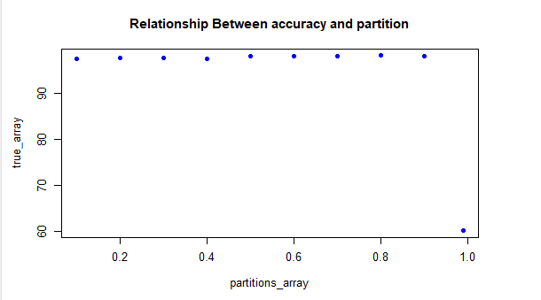

```{r setup, include=FALSE}
knitr::opts_chunk$set(echo = TRUE)

library(prettydoc)
library(shiny)
library(randomForest)
library(readr)
library(caret)
library(e1071)
```

# REFERENCES

List of references:
  
  - Source data [KDD Cup 1999 Data Data Set](https://archive.ics.uci.edu/ml/datasets/kdd+cup+1999+data)
  - A Detailed [Analysis of the KDD CUP 99 Data Set](https://www.ecb.torontomu.ca/~bagheri/papers/cisda.pdf)
  - KDD [download archive](https://www.kdd.org/kdd-cup/view/kdd-cup-1999/Data)
  - Kaggle comunity [notebooks](https://www.kaggle.com/datasets/galaxyh/kdd-cup-1999-data/code) with KDD CUP 99 data set.
  
# DATASETS

```{r read_data}
data_full <- read_csv("../data/original_data/Book1.csv",
                  col_types = cols(SrcBytes = col_integer(),
                                   DstBytes = col_integer(), Land = col_integer(),
                                   WrongFragment = col_integer(), Urgent = col_number(),
                                   Hot = col_number(), NumFailedLogin = col_integer()))

data <- read.csv (file="../data/original_data/Book2.csv",header=T)

```

# OBJETIVO

<div style="text-align: justify">
En este análisis, nuestro objetivo es explorar el conjunto de datos de la Copa KDD de 1999 y obtener información sobre los comportamientos del tráfico de red. Mediante el empleo de técnicas de análisis de datos exploratorios, examinaremos la estructura, las distribuciones y las relaciones entre los atributos del conjunto de datos. Profundizaremos en la distribución de clases para comprender la prevalencia de las conexiones normales frente a las intrusiones, y analizaremos las características de los diferentes tipos de conexión de red. Además, aplicaremos algoritmos de aprendizaje automático para construir modelos de clasificación capaces de predecir con precisión las intrusiones en la red en función de los atributos disponibles. Este análisis proporcionará información valiosa sobre la naturaleza del tráfico de la red, ayudará a identificar posibles amenazas de seguridad y contribuirá al desarrollo de sistemas de detección de intrusos eficaces. 
</div>

# COMPRENSIÓN DEL CONJUNTO DE DATOS

<div style="text-align: justify">
Para iniciar el análisis es entender en qué consisten los datos proporcionados. En el extracto de Book2.csv podemos encontrar las siguientes columnas con su respectiva definición en los anexos. Con estas definiciones podemos comprender el conjunto de datos, su estructura y el contenido. 
</div>

# ANÁLISIS EXPLORATORIO DE DATOS

<div style="text-align: justify">
El siguiente paso es la visualización de datos, crearemos visualizaciones como histogramas, diagramas de caja, diagramas de dispersión o matrices de correlación para comprender la distribución, las relaciones y los posibles valores atípicos en los datos. 
</div>

# EXPLICACIÓN DEL CÓDIGO

## Configuración del ambiente

<div style="text-align: justify">
knitr::opts_chunk$set(echo = TRUE) establece la opción global para incluir salidas de fragmentos de código, es decir, repetir el código, de forma predeterminada. Esto significa que el código y su resultado se mostrarán en el documento final a menos que se especifique lo contrario.

Las líneas subsiguientes cargan las bibliotecas requeridas usando la función library(). En este caso, el código carga las siguientes bibliotecas: randomForest, readr, caret y e1071. Estas bibliotecas proporcionan funciones y herramientas adicionales para el análisis de datos y el aprendizaje automático.

selected_cols se define como un vector que contiene los nombres de las columnas seleccionadas del conjunto de datos. Las columnas especificadas incluyen "SrcBytes", "DstBytes", "WrongFragment", "Urgent", "SameSrvRate", "LoggedIn", "DstHostSameSrvRate", "DstHostSrvCount", "Flag" y "Attack". Estas son las columnas que se utilizarán en el análisis o modelado luego en el reporte.

El propósito de este fragmento de código es configurar el entorno de R, cargar las bibliotecas necesarias y definir un vector selected_cols que contenga los nombres de las columnas seleccionadas de un conjunto de datos. 
</div>

# EXPLICACIÓN DEL CÓDIGO

##Bases de datos

<div style="text-align: justify">
Las variables en Columnas y la unidad de análisis en filas.

El código lee los datos de un archivo CSV llamado "Book2.csv" ubicado en el directorio "../data" relativo al directorio de trabajo actual. La función read.csv() se utiliza para leer el archivo CSV. El argumento del archivo especifica la ruta del archivo y header = T indica que el archivo tiene una fila de encabezado. Los datos resultantes se almacenan en la variable "data".
</div>
## Selección de columnas

<div style="text-align: justify">
Se selecciona columnas específicas del conjunto de datos y las asigna a un nuevo conjunto de datos denominado data1. La notación data[,selected_cols] se usa para seleccionar todas las filas (data[,) y solo las columnas especificadas en el vector selected_cols inicializado previamente. Esta operación crea subconjuntos del conjunto de datos original para incluir solo las columnas deseadas.

Luego se convierte la columna Atack del conjunto de datos data1 en una variable de factor utilizando la función as.factor(). Los factores se utilizan en R para representar variables categóricas o nominales. Convertir Attack en un factor sugiere que es una variable categórica con distintos niveles o clases.
</div>

## Procesamiento de datos

<div style="text-align: justify">
Se hace un for loop donde se llama la función ´training_method´que trae el valor del porcentage de aciertos según la partición que se utilice (punto importante de tener en mente, la particion debe ser igual a la cantidad de loops que se quiera hacer, por ejemplo, si se quiere probar 100 veces entonces la partición tendrá un valor de 100. Entre más loops haga más datos tendremos para analisar sin embargo tarda más tiempo procesando los datos y por lo tanto incrementa el tiempo para la creación del reporte

La función ´training_method´ realiza los siguientes pasos:

Toma un parámetro "partition" como entrada.
1. Utiliza la función "createDataPartition()" para dividir la variable "Attack" en el conjunto de datos "data1" en particiones de entrenamiento y prueba basadas en el valor de partición especificado.
1. Crea el conjunto de datos de "training" subdividiendo "datos1" en función de los índices obtenidos de "createDataPartition()".
1. Crea el conjunto de datos "testing" subdividiendo "data1" excluyendo los índices obtenidos de"createDataPartition()".
1. Calcula el número de filas en el conjunto de datos de training y lo almacena en una variable llamada "dim".
1. Se ajusta a un modelo de bosque aleatorio ("randomForest()") con "Ataque" como variable de respuesta y todas las demás variables en el conjunto de datos `training`.
1. Imprime la salida del modelo de bosque aleatorio usando "print(output.forest)".
1. Crea una gráfica del modelo de bosque aleatorio usando "plot(output.forest)".
1. Genera predicciones (`pred`) en el conjunto de datos "testing" utilizando el modelo de bosque aleatorio entrenado.
1. Convierte las columnas "Attack" y "pred" en el conjunto de datos "testing" al tipo de carácter.
1. Compara las columnas "Attack" y "pred" para verificar si coinciden y asigna el resultado a la columna "match" en el conjunto de datos "valid".
1. Se calcula el porcentaje de valores coincidentes entre los valores de ataque pronosticados y reales mediante la función de tabla. Divide el recuento de coincidencias por el número total de filas en el marco de datos válido y lo multiplica por 100 para obtener el porcentaje.
1. SAe convierte el objeto de la tabla en un marco de datos usando as.data.frame. Luego, extraen el valor en la segunda fila y la segunda columna del marco de datos, almacenándolo en la variable value_df.

La función parece ser una implementación personalizada para entrenar un modelo de bosque aleatorio, evaluar su rendimiento y devolver el porcentaje de valores coincidentes en las predicciones.
</div>

## Ejemplo de un gráfico con 10 valores





# ANÁLISIS DE LOS RESULTADOS

<div style="text-align: justify">
El gráfico representa la relación entre el porcentage de aciertos, representando el eje Y, con la partición, representando el eje X. Se muestra una tendencia ascendente, cuando el valor de partición aumenta tambien aumenta el porcentage de aciertos, sin embargo hay un punto en el gráfico donde cae drásticamente el porcentage de aciertos. Esto podria ocurrir porque el modelo no tiene una muestra suficiente para entrenarse de manera correcta y por lo tanto hay más falsos.
</div>


